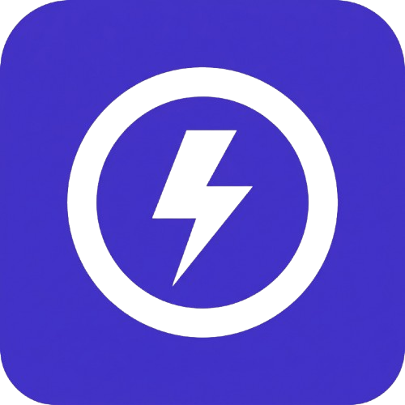
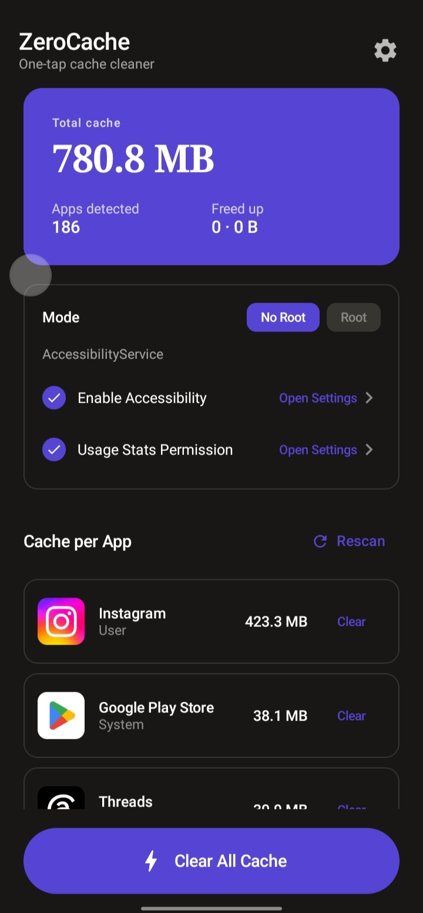

<p align="center">
  
</p>

<h1 align="center">ZeroCache</h1>
<p align="center">
  <strong>One-tap Android cache cleaner with Root & No-Root modes</strong>
</p>

<p align="center">
  <a href="https://github.com/Curzyori/zero-cache/tree/main/version"><strong>📦 Current Version Build</strong></a>
</p>

<div align="center">

[](https://github.com/Curzyori/zero-cache/stargazers)
[](https://github.com/Curzyori/zero-cache/network/members)
[](LICENSE)
[](#)

</div>

<p align="center">
  <a href="#-why-zerocache">Why This</a> ·
  <a href="#-key-features">Features</a> ·
  <a href="#-installation">Installation</a> ·
  <a href="#-preview">Preview</a>
</p>

---

## 🕒 Why ZeroCache?

Most Android cache cleaners either require root access, show intrusive ads, or lack transparency about what they are doing. ZeroCache solves this with a clean, privacy-first approach that gives you full visibility and control.

|                               |                                                              |
| ----------------------------- | ------------------------------------------------------------ |
| ⚡ **One-Tap Clear**          | Clears all app cache with a single button press.             |
| 🔒 **Privacy First**          | No ads, no tracking, fully local processing.                 |
| 🌐 **No Root Required**       | Uses AccessibilityService for non-root devices.               |
| 💪 **Root Mode**              | Optional full `pm clear` access for rooted devices.           |
| 🌏 **Multi-Language**         | Supports English and Bahasa Indonesia out of the box.         |

---

## 🎯 Key Features

| Feature | Status | Description |
| :--- | :---: | :--- |
| **One-Tap Clear All** | ✅ | Single button to clear all detected app cache. |
| **No-Root Mode** | ✅ | Uses AccessibilityService to auto-tap Clear Cache button. |
| **Root Mode** | ✅ | Direct `pm clear` commands for faster clearing on rooted devices. |
| **Live Progress** | ✅ | Animated 3-dot indicator during clearing process. |
| **Dark Mode** | ✅ | System-wide dark and light theme support. |
| **Multi-Language** | ✅ | Toggle between English and Bahasa Indonesia. |
| **Settings Menu** | ✅ | Quick access to language, GitHub repo, and crypto donation addresses. |

---

## 🛠 Tech Stack

- **Platform:** Android
- **Language:** Kotlin
- **UI Framework:** Jetpack Compose with Material Design 3
- **Min SDK:** 26 (Android 8.0)
- **Target SDK:** 35 (Android 15)
- **Architecture:** Single-Activity, Single-Screen Compose UI
- **License:** Apache 2.0

---

## 📦 Installation

Download the latest APK from the [version folder](https://github.com/Curzyori/zero-cache/tree/main/version):

| Version | File |
| :--- | :--- |
| v1.0.0 | `Zero-Cache-V1.0.0.apk` |

### Build from Source
```bash
git clone https://github.com/Curzyori/zero-cache.git
cd zero-cache
./gradlew assembleDebug
```

Output: `app/build/outputs/apk/debug/app-debug.apk`

---

## 🖼️ Preview

<p align="center">
  
</p>

---

## 📄 License

This project is released under the **Apache License 2.0** — see [LICENSE](LICENSE) for full text.

<sub>Built with passion as the 16th Project of the 50 Projects Challenge by **@Curzyori**</sub>
